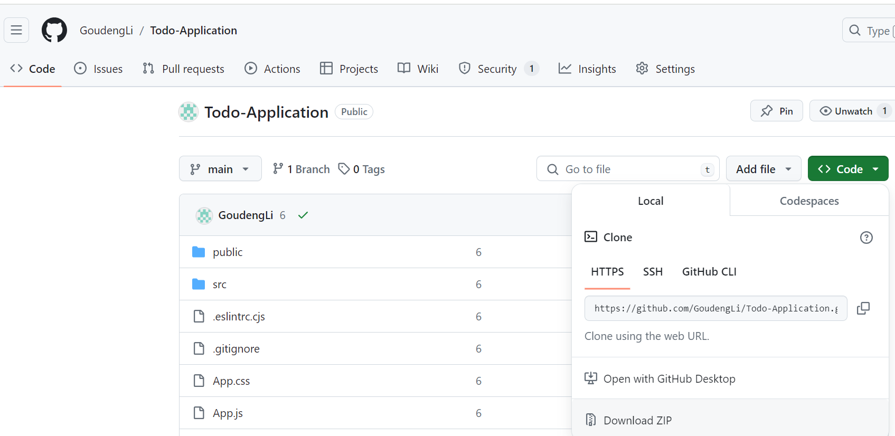
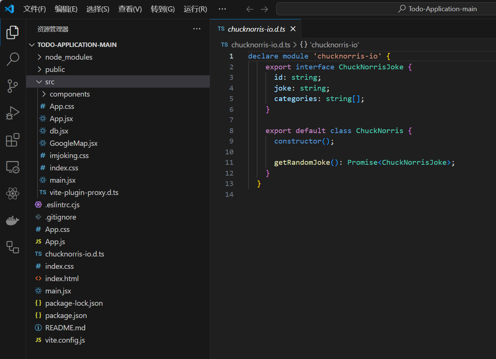
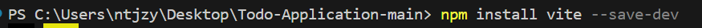
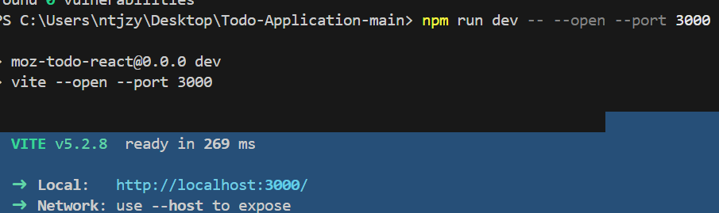
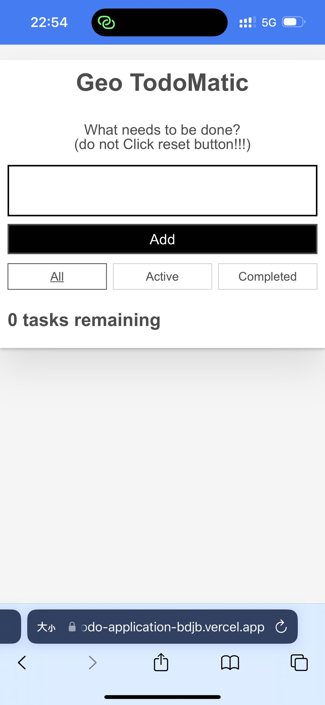
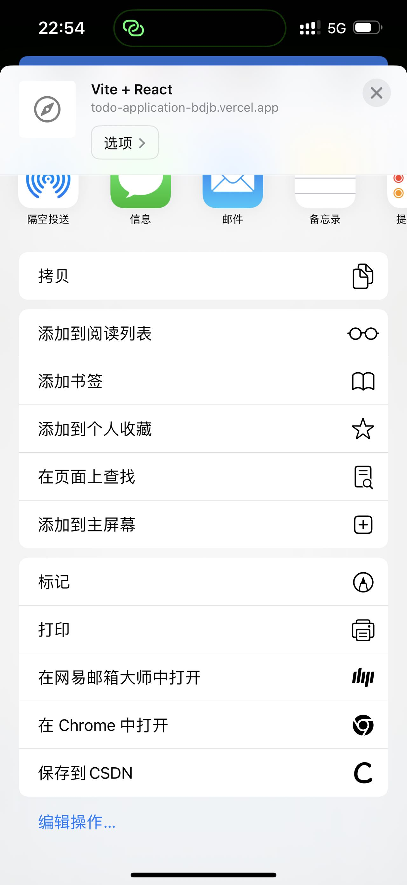
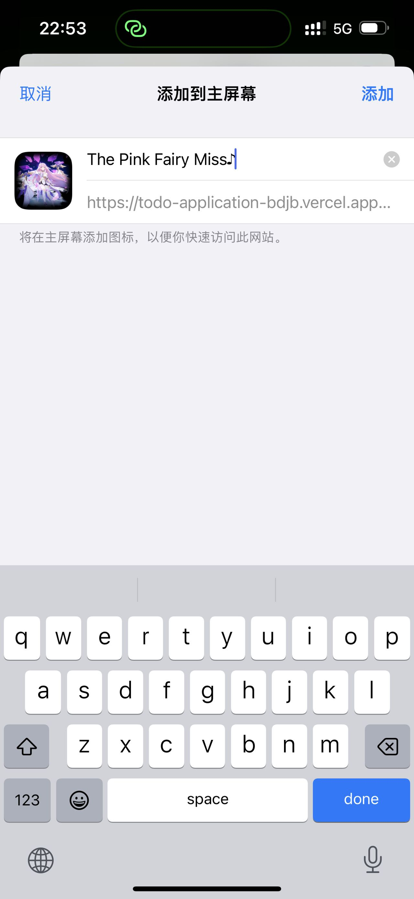
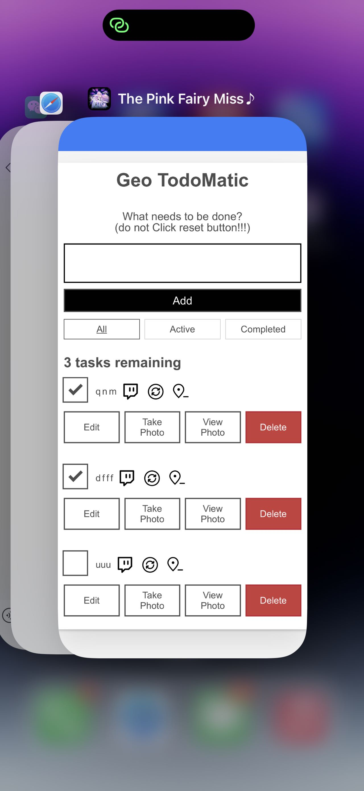

# React + Vite

This template provides a minimal setup to get React working in Vite with HMR and some ESLint rules.

Currently, two official plugins are available:

- [@vitejs/plugin-react](https://github.com/vitejs/vite-plugin-react/blob/main/packages/plugin-react/README.md) uses [Babel](https://babeljs.io/) for Fast Refresh

- [@vitejs/plugin-react-swc](https://github.com/vitejs/vite-plugin-react-swc) uses [SWC](https://swc.rs/) for Fast Refresh

  here are the download steps：

  Pc：

  download zip file：todo-application.zip

  

  Open directly in VS Code after decompression

  

  down load vite in cmd

  

  run npm run dev to start application after vite be downloaded

  

  click the src provided in Local: to visit the App 

  PE：

  here is the download method for iphone：

  visit webhttps://todo-application-bdjb.vercel.app/

  

  click the third icon in the bottom of screen

  then click"add to main screen"

  

  click the add icon

  

  find the icon on your main screen click it and use it

  
